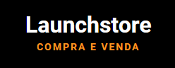

<h1 align="center">
    
</h1>

<h3 align="center">
  LaunchStore - An E-Commerce
</h3>

<blockquote align="center">“Do your best, but always with delivery time!”</blockquote>


<p align="center">
  <a href="#information_source-description">Description</a>&nbsp;&nbsp;&nbsp;|&nbsp;&nbsp;&nbsp;
  <a href="#rocket-technologies">Technologies</a>&nbsp;&nbsp;&nbsp;|&nbsp;&nbsp;&nbsp;
  <a href="#information_source-how-to-use">How To Use</a>
</p>

## :information_source: Description
This challenge is called LaunchStore, we developed a complete website for a marketplace. Project made in Bootcamp LaunchBase.

## :rocket: Technologies

This project was developed to train my skills in front-end and back-end with the following technologies:

### FRONT-END
-  [HTML][HTML]
-  [CSS][CSS]
-  [Java-Script][Java-Script]


### BACK-END
-  [Nunjucks][Nunjucks]
-  [Java-Script][Java-Script]
-  [Express][Express]
-  [NodeJS][NodeJS]
-  [PostgreSQL][PostgreSQL]


## :information_source: How To Use

To clone and run this application, you'll need [Git](https://gitforwindows.org/), [Node.js v12.18.0][NodeJS] or higher installed on your computer and the [First Project](https://github.com/Matheus-nb/LaunchStore). From your command line:

### Install NLW
```bash

# Go into the Foodfy path
$ cd Foodfy

# Install dependencies
$ npm install

# Configure PostgreSQL
user: "user-name",
password: "",
host:"localhost",
port: 5432,
database: "database-name"

# Run Queries on database.sql in the PostgreSQL
$ database.sql

# Run the LaunchStore
$ npm start
```


---

Feito com :heart: by [Matheus Lascalla](https://www.linkedin.com/in/matheus-nb/) :wave: 

[NodeJS]: https://nodejs.org/
[CSS]:https://developer.mozilla.org/en-US/docs/Web/CSS
[Java-Script]:https://developer.mozilla.org/en-US/docs/Glossary/JavaScript
[HTML]:https://developer.mozilla.org/en-US/docs/Web/HTML
[Nunjucks]:https://mozilla.github.io/nunjucks/
[PostgreSQL]:https://www.postgresql.org/
[Express]:https://expressjs.com/pt-br/

